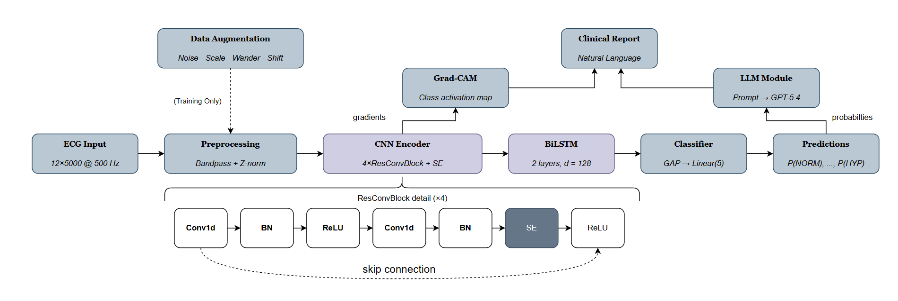
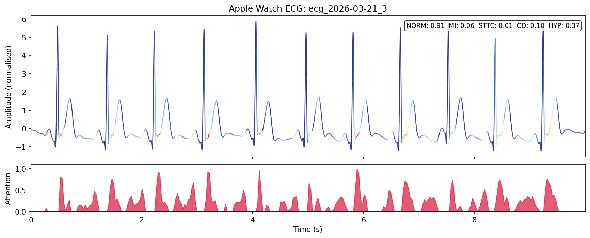

<p align="center">
  <h1 align="center">HeartLens</h1>
  <p align="center">
    <b>Apple Watch 心电图 AI 深度分析 | 比自带功能多识别 4 种心脏异常 | Qwen3.5 端侧解读 | 完全离线</b>
  </p>
  <p align="center">
    <a href="#快速开始">快速开始</a> · <a href="#功能特性">功能特性</a> · <a href="#效果展示">效果展示</a> · <a href="docs/README_EN.md">English</a>
  </p>
  <p align="center">
    
    
    
    
  </p>
</p>

Apple Watch 自带的心电图功能只能告诉你"窦性心律"或"房颤"，两个分类，没有更多信息。**HeartLens 把这个能力提升了一个量级。**

同一条 Apple Watch 心电数据，HeartLens 能识别 **5 类心脏异常**（心肌梗死、传导阻滞、ST/T 改变、心室肥大、正常），并且直接在你的心电波形上**用颜色可视化** AI 的判断依据：红色区域代表 AI 高度关注，蓝色区域代表忽略。你不只是得到一个结论，而是能亲眼看到模型在心电图的哪个波形、哪个时间点上做出了判断。最后，本地运行的 Qwen3.5-4B 直接"看"这张带颜色的心电图，为你生成一份通俗易懂的解读报告。

全程完全离线，零联网、零上传、零 API 调用。

> **为什么选 Qwen3.5-4B？** 我们在 34 个测试场景上对比了 GPT-5.4（商用 API）和 Qwen3.5 全系列（0.8B / 2B / 4B）。在多模态模式下（LLM 直接看 Grad-CAM 热力图），**Qwen3.5-4B 实现了与 GPT-5.4 完全相同的临床解释质量，零幻觉、100% 完整度**，同时推理速度快 3 倍，且整个模型只有 3.4GB，一张消费级显卡甚至纯 CPU 就能跑。



## 它能做什么

1. **读取 Apple Watch ECG** — 直接解析 iPhone 健康 App 导出的 CSV 文件（512Hz 单导联）
2. **5 类心脏异常分类** — CNN-LSTM 模型识别心肌梗死、传导阻滞、ST/T 改变、心室肥大、正常（Apple Watch 自带只有 2 类）
3. **心电波形染色可视化** — Grad-CAM 热力图直接在你的心电波形上用红蓝颜色标注 AI 的关注区域，让你看到每一个判断的依据
4. **Qwen3.5 端侧解读** — 本地 Qwen3.5-4B 多模态模型直接"看"染色后的心电图生成临床解读，不调任何外部 API
5. **完全离线** — 从录制到出报告，所有计算都在你自己的机器上完成

## 效果展示

### 你的心电图会被"染色"


> 这条心电来自 PTB-XL 临床数据库（**标准 12 导联**采集，这里展示的是 Lead I）。AI 用颜色告诉你它在看哪里：**红色/橙色 = 高度关注**，**蓝色 = 忽略**。这个例子是传导阻滞（CD，置信度 97%）。注意模型**没有**关注最高的 R 波尖峰（蓝色），而是把注意力集中在每个心跳周期中 R 波之后的次级偏转上（红色/橙色）。这正是传导阻滞的临床判断逻辑：异常不在于 R 波的幅度，而在于 QRS 波群的形态变化（如增宽、切迹、继发偏转），这些微妙的形态特征才是区分正常传导和阻滞的关键。下方的红色面积图是原始注意力强度，每个周期性峰值对应一次心跳的异常形态区域。

### Apple Watch 真实心电分析



> Apple Watch 只有**单导联**（相当于 Lead I），信息量远少于医院的 12 导联心电图，但 HeartLens 的单导联模型（macro AUC 0.832）依然能从中提取足够的诊断信号。上图是团队成员 Apple Watch 导出的真实心电（2026 年 3 月录制）。波形整齐、颜色以蓝色为主、没有集中的红色高关注区域，说明模型没有发现异常。最终判断：窦性心律（正常），置信度 91%。这就是健康心脏的样子。

## 快速开始

三步启动，无需 GPU：

```bash
# 1. 克隆项目
git clone https://github.com/patr1ckzhu/HeartLens-AppleWatch.git
cd HeartLens-AppleWatch
conda env create -f environment.yml && conda activate heartlens

# 2. 拉取端侧 LLM（Qwen3.5-4B，3.4GB，只需下载一次）
curl -fsSL https://ollama.com/install.sh | sh
ollama pull qwen3.5:4b

# 3. 启动
python demo/app.py
```

启动后 Gradio 会自动打开本地页面（`localhost:7860`），界面底部已预置样例心电文件，**点一下就能看到完整分析结果**（没有 Apple Watch 也能体验）。你也可以上传自己的 CSV。

### 如何从 Apple Watch 导出 ECG

Apple Watch 的 ECG 数据不能单条导出，需要通过「健康」App 统一导出全部健康数据：

1. 打开 Apple Watch 上的 **ECG**（心电图）App，手指放在数码表冠上录制 30 秒
2. iPhone 打开**健康** App → 点击右上角**头像** → 滑到底部 → **导出所有健康数据**
3. 等待几分钟，选择「储存到文件」或通过 AirDrop 传到电脑
4. 解压导出的 ZIP，ECG 文件在 `apple_health_export/electrocardiograms/` 目录下：

```
apple_health_export/
  └── electrocardiograms/
        ├── ecg_2024-01-15.csv
        ├── ecg_2024-03-20.csv
        └── ...
```

上传其中任意一个 CSV 文件到 HeartLens 即可。

## 功能特性

| 特性 | 说明 |
|------|------|
| 🏥 **5 类心脏异常检测** | 正常 / 心肌梗死 / ST-T 改变 / 传导阻滞 / 心室肥大 |
| 📊 **PTB-XL 基准验证** | 12 导联 macro AUC 0.914，单导联（Apple Watch）0.832 |
| ⌚ **Apple Watch 原生支持** | 直接解析 512Hz CSV，自动重采样和预处理 |
| 🎨 **心电波形染色可视化** | 红色 = AI 高度关注，蓝色 = 忽略，每个判断都有据可查 |
| 🤖 **Qwen3.5 端侧解读** | 4B 多模态模型直接看染色心电图生成报告，效果匹配 GPT-5.4 |
| 🔒 **完全端侧离线** | 零云端、零 API、零数据上传 |
| ⚡ **消费级硬件** | CPU 可跑，有 GPU 更快 |

## 为什么是 Qwen3.5-4B + 多模态？

传统方案是把 AI 分析结果转成文字描述再喂给 LLM，但这样小模型容易产生**幻觉**（编造不存在的异常）。我们发现了一个更好的方案：

**直接把染色后的心电图作为图像输入给 Qwen3.5 的视觉能力。**

当 LLM 能"看到"真实的心电波形和注意力分布时，它会被视觉证据锁定，不再胡编。

| 模式 | GPT-5.4 | Qwen3.5-4B | Qwen3.5-2B | Qwen3.5-0.8B |
|------|---------|------------|------------|---------------|
| 文本输入（幻觉率） | **0%** | 15% | 24% | 15% |
| 图像输入（幻觉率） | **0%** | **0%** | **0%** | **0%** |
| 平均延迟 | 7.4s | **2.7s** | 2.0s | 1.2s |
| 需要联网？ | 是 | **否** | **否** | **否** |

**结论：Qwen3.5-4B + 多模态 = 商用 API 的质量 + 端侧的隐私保护。**

### 端侧部署路线图

我们的实验结果支持分层端侧部署：

| 部署层级 | 模型 | 大小 | 场景 |
|----------|------|------|------|
| ⌚ 手表/可穿戴 | Qwen3.5-0.8B | 1.0GB | 实时心率监测 + 异常提醒 |
| 📱 手机 | Qwen3.5-4B | 3.4GB | 完整 ECG 分析 + 染色可视化 + 解读报告 |
| 💻 电脑/诊所 | Qwen3.5-4B / 9B | 3.4-7GB | 多导联分析 + 详细临床解读 |

0.8B 到 4B 在多模态模式下均为零幻觉。模型选择取决于你的硬件和延迟要求。

## 技术架构

```
Apple Watch ECG (512Hz CSV)
  → 重采样至 500Hz + 带通滤波 (0.5-40Hz) + z-score 归一化
  → CNN-LSTM 分类器
      残差 1D 卷积 (SE 注意力) → 双向 LSTM → 5 类诊断概率
  → Grad-CAM 注意力热力图（心电波形染色）
  → Qwen3.5-4B 多模态推理
      输入: 染色心电图图像 + 诊断概率 → 输出: 自然语言临床解读
```

### 消融实验

| 模型 | Macro AUC | 参数量 |
|------|-----------|--------|
| Random Forest (基线) | 0.861 | — |
| LSTM-only | 0.908 | 0.7M |
| CNN-only | 0.912 | 1.2M |
| **CNN-LSTM (本项目)** | **0.914** | **1.5M** |
| CNN-Transformer | 0.913 | 3.3M |

CNN encoder 贡献了绝大部分分类能力。LSTM 和 Transformer 在固定长度 10 秒录音上差异可忽略，我们选择 CNN-LSTM 因为它参数最少、训练最稳定、与 Grad-CAM 兼容性最好。

## 硬件要求

| 场景 | 最低配置 | 推荐配置 |
|------|----------|----------|
| 仅分类（无 LLM） | CPU，2GB RAM | 任意 GPU |
| 分类 + Qwen3.5-0.8B | CPU，4GB RAM | 任意 GPU |
| 分类 + Qwen3.5-4B | 8GB RAM | GPU 6GB+ VRAM |
| 模型训练 | GPU 8GB+ VRAM | GPU 16GB VRAM |

## 项目结构

```
HeartLens-AppleWatch/
├── configs/            # 超参数配置
├── data/               # 数据加载与预处理
├── demo/               # Gradio 交互式 Demo
├── evaluation/         # 评估脚本（分类/LLM/多模态）
├── experiments/        # 训练与消融实验
├── llm/                # LLM 解释模块（Ollama + 规则基线）
├── models/             # CNN-LSTM / CNN-only / LSTM-only / Transformer
└── report/             # 学术论文 (TMLR 格式)
```

## 免责声明

**HeartLens 是一个研究原型，不是医疗器械。** 输出结果不构成医学诊断，不能替代医生的专业判断。如果你对心脏健康有任何疑虑，请咨询医疗专业人士。本项目仅供学术研究和技术探索。

## 引用

如果这个项目对你有帮助：

```bibtex
@article{heartlens2026,
  title={HeartLens: Interpretable ECG Screening with CNN-LSTM and LLM Explanation},
  author={Ding, Ziqi and Ding, Zihan and Li, Ning and Liu, Estelle and Zhu, Patrick},
  year={2026},
  institution={University College London}
}
```

## Star History

如果你觉得这个项目有意思，请给个 Star 让更多人看到！

## 许可证

[MIT License](LICENSE)
